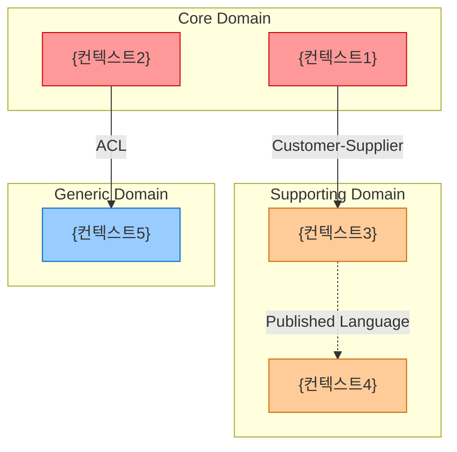
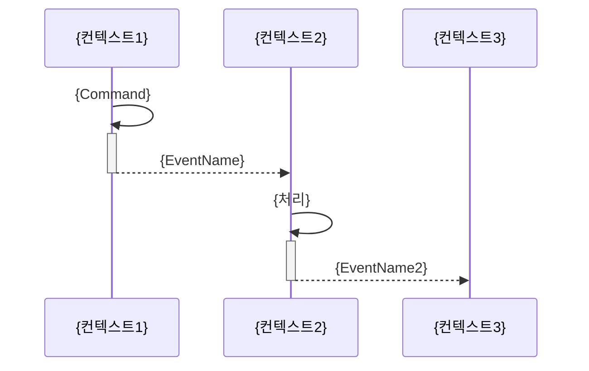

# {프로젝트명} DDD 도메인 분류 문서

| 항목 | 내용 |
|------|------|
| 문서 버전 | v1.0 |
| 작성일 | YYYY-MM-DD |
| 작성자 | {이름} |
| 분석 대상 | {소스코드 경로 또는 참조 문서명} |
| 입력 모드 | 소스코드 분석 / 문서 기반 분석 |
| 문서 상태 | 초안 / 검토중 / 확정 |

## 변경 이력

| 버전 | 일자 | 작성자 | 변경 내용 |
|------|------|--------|---------|
| v1.0 | YYYY-MM-DD | {이름} | 최초 작성 |

---

## 1. 경영진 요약 (Executive Summary)

> 이 섹션은 의사결정자가 5분 안에 읽을 수 있도록 작성한다.

**분석 대상:** {프로젝트명}의 비즈니스 도메인 전체

**핵심 발견사항:**
- 식별된 서브도메인: {N}개 (Core {N}개 / Supporting {N}개 / Generic {N}개)
- 핵심 바운디드 컨텍스트: {N}개
- 주요 도메인 이벤트: {N}개

**전략적 권고사항:**
{핵심 도메인에 집중 투자, 제네릭 도메인은 SaaS 전환 등 2~3가지 권고}

**컨텍스트 맵 요약:**
```mermaid
graph LR
    {간략 컨텍스트 맵 - 전체 맵의 요약본}
```

---

## 2. 비즈니스 도메인 개요

### 2.1 비즈니스 설명

{조직이 하는 일, 가치 제안, 주요 고객 세그먼트를 2~3문단으로 설명}

### 2.2 핵심 비즈니스 역량 (Business Capabilities)

| # | 비즈니스 역량 | 설명 | 관련 이해관계자 |
|---|-------------|------|--------------|
| BC-01 | {역량명} | {설명} | {이해관계자} |
| BC-02 | | | |

### 2.3 분석 범위 및 제약

**분석 포함:**
- {포함된 시스템/모듈/문서 목록}

**분석 제외:**
- {제외된 영역 및 제외 이유}

**전제 조건 및 제약:**
- {분석 시 적용한 가정 및 제약사항}

---

## 3. 서브도메인 식별 및 분류

### 3.1 분류 기준 요약

| 분류 | 정의 | 구현 전략 |
|------|------|---------|
| **Core** | 비즈니스 경쟁 우위의 원천. 차별화된 전문성이 필요 | 사내 최고 인재로 개발 |
| **Supporting** | 핵심을 지원하나 그 자체가 차별화는 아님 | 사내 개발 또는 맞춤형 COTS |
| **Generic** | 모든 비즈니스에 공통적인 해결된 문제 | SaaS/오픈소스/외주 |

### 3.2 서브도메인 분류표

| # | 서브도메인 | 분류 | 비즈니스 차별화 | 복잡도 | 변경 빈도 | 구현 전략 | 분류 근거 요약 |
|---|----------|------|--------------|--------|---------|---------|-------------|
| SD-01 | {이름} | Core / Supporting / Generic | 상/중/하 | 상/중/하 | 높음/보통/낮음 | {전략} | {1~2문장} |
| SD-02 | | | | | | | |

### 3.3 서브도메인 상세

각 서브도메인에 대해 아래 형식으로 기술한다.

---

#### SD-01: {서브도메인명} `[Core / Supporting / Generic]`

**책임:** {이 서브도메인이 담당하는 비즈니스 능력}

**핵심 비즈니스 규칙:**
- {규칙 1}
- {규칙 2}

**주요 데이터/개념:** {이 도메인의 핵심 개념어 나열}

**의존성:**
- 상위 의존: {이 서브도메인이 의존하는 다른 서브도메인}
- 하위 의존: {이 서브도메인에 의존하는 다른 서브도메인}

**분류 근거:**
{Core/Supporting/Generic으로 분류한 상세 이유. 비즈니스 전략적 관점에서 설명}

---

### 3.4 분류 시각화

```mermaid
quadrantChart
    title 서브도메인 분류 매트릭스
    x-axis 낮은 비즈니스 차별화 --> 높은 비즈니스 차별화
    y-axis 낮은 복잡도 --> 높은 복잡도
    quadrant-1 Core Domain
    quadrant-2 Supporting Domain (복잡한 지원)
    quadrant-3 Generic Domain
    quadrant-4 Supporting Domain (단순 지원)
    {SD-01}: [x좌표, y좌표]
    {SD-02}: [x좌표, y좌표]
```

> 좌표는 0.0 ~ 1.0 범위. Core는 오른쪽 위, Generic은 왼쪽 아래에 위치

---

## 4. 바운디드 컨텍스트 정의

### 4.1 컨텍스트 목록

| # | 컨텍스트명 | 담당 서브도메인 | 핵심 책임 | 담당 팀 | 배포 단위 | 데이터 소유 |
|---|----------|--------------|---------|--------|---------|-----------|
| BC-01 | {이름} | SD-0N | {책임 요약} | {팀명} | 마이크로서비스 / 모듈 / 모놀리스 | {소유 데이터} |
| BC-02 | | | | | | |

### 4.2 컨텍스트 상세

각 바운디드 컨텍스트에 대해 아래 형식으로 기술한다.

---

#### BC-01: {컨텍스트명}

**핵심 책임:** {이 컨텍스트가 책임지는 비즈니스 능력}

**담당 서브도메인:** SD-0N ({서브도메인명})

**유비쿼터스 언어 핵심 용어:**
- `{Term1}`: {이 컨텍스트에서의 의미}
- `{Term2}`: {이 컨텍스트에서의 의미}

**핵심 애그리게이트:** {Aggregate1}, {Aggregate2}

**외부 의존성:**
- 상위(Upstream): {의존하는 컨텍스트명} — {의존 이유}
- 하위(Downstream): {의존받는 컨텍스트명}

**경계 결정 근거:**
{왜 이 경계로 나눴는지 — 언어 경계, 데이터 소유권, 팀 구조, 배포 독립성 등을 근거로}

---

### 4.3 컨텍스트 경계 결정 원칙

이 문서에서 적용한 경계 결정 원칙:
1. {원칙 1: 예) 유비쿼터스 언어가 분기되는 지점에서 경계 설정}
2. {원칙 2: 예) 팀 자율성을 보장할 수 있는 단위로 분리}
3. {원칙 3: 예) 트랜잭션 경계와 컨텍스트 경계를 일치}

---

## 5. 컨텍스트 맵 (Context Map)

### 5.1 전체 다이어그램



### 5.2 관계 카탈로그

| # | 상류 컨텍스트 (Upstream) | 하류 컨텍스트 (Downstream) | 관계 패턴 | 통합 방식 | 계약 방향 | 설명 |
|---|----------------------|--------------------------|---------|---------|---------|------|
| CM-01 | {컨텍스트명} | {컨텍스트명} | Customer-Supplier | REST API / Event / gRPC | 상류 주도 / 협력 | {관계 설명} |
| CM-02 | | | | | | |

**관계 패턴 범례:**

| 패턴 | 설명 | 특징 |
|------|------|------|
| **Shared Kernel** | 공유 코드/모델 | 양쪽 팀 합의 필수, 변경 시 공동 결정 |
| **Customer-Supplier** | 상류가 하류의 요구를 수용 | 상류가 API 제공, 하류가 계획에 영향 |
| **Conformist** | 하류가 상류 모델을 그대로 따름 | 통합 단순, 하류 자율성 낮음 |
| **ACL (Anticorruption Layer)** | 하류가 번역 레이어 구축 | 하류 독립성 보장, 구현 비용 높음 |
| **Open Host Service** | 상류가 공개 프로토콜 제공 | 여러 하류 지원, 변경 영향 최소화 |
| **Published Language** | 표준화된 공유 언어 | 업계 표준/스키마 사용, 높은 호환성 |
| **Separate Ways** | 통합 없음 | 완전 독립, 기능 중복 가능 |
| **Partnership** | 양쪽이 함께 조율 | 긴밀한 팀 협력 필요 |

---

## 6. 유비쿼터스 언어 용어집

> 같은 용어라도 컨텍스트마다 다른 의미를 가질 수 있다. 각 컨텍스트별로 정의하는 것이 핵심이다.

### {BC-01 컨텍스트명} 용어집

| 용어 (한국어) | 용어 (영문) | 정의 | 코드 표현 | 동의어 / 주의사항 |
|-------------|-----------|------|---------|----------------|
| {용어} | {Term} | {이 컨텍스트에서의 정확한 의미} | `{ClassName}` | {혼동하기 쉬운 다른 컨텍스트의 동명 용어 주의} |

### {BC-02 컨텍스트명} 용어집

| 용어 (한국어) | 용어 (영문) | 정의 | 코드 표현 | 동의어 / 주의사항 |
|-------------|-----------|------|---------|----------------|
| | | | | |

### 교차 컨텍스트 용어 비교

동일 용어가 여러 컨텍스트에서 다른 의미로 쓰이는 경우:

| 용어 | BC-01에서의 의미 | BC-02에서의 의미 | 차이점 설명 |
|------|---------------|---------------|-----------|
| {공통 용어} | {의미1} | {의미2} | {왜 다른지} |

---

## 7. 도메인 이벤트 카탈로그

> 도메인 이벤트는 과거형 동사로 명명한다. (예: `OrderPlaced`, `PaymentApproved`)

| # | 이벤트명 | 발행 컨텍스트 | 트리거 | 구독 컨텍스트 | 페이로드 요약 | 멱등성 키 | 비즈니스 중요도 |
|---|--------|------------|--------|------------|------------|---------|-------------|
| DE-01 | `{EventName}` | BC-0N | {트리거 커맨드 또는 상태 변화} | BC-0N, BC-0M | {주요 필드: id, 상태, 타임스탬프} | {id 필드명} | 높음/보통/낮음 |
| DE-02 | | | | | | | |

### 이벤트 흐름 다이어그램

주요 비즈니스 시나리오의 이벤트 연쇄를 보여준다:



---

## 8. 애그리게이트 식별

> 애그리게이트는 트랜잭션 일관성 경계다. 하나의 트랜잭션 = 하나의 애그리게이트.

### {BC-01 컨텍스트명} 애그리게이트

| # | 애그리게이트 | Root Entity | 포함 Entity | Value Object | 핵심 불변식 | 외부 참조 (ID만) | 예상 트랜잭션 빈도 |
|---|-----------|-----------|-----------|-------------|-----------|--------------|----------------|
| AG-01 | `{AggregateName}` | `{RootEntityClass}` | `{EntityClass}` | `{ValueObjectClass}` | {반드시 지켜야 할 규칙} | `{OtherAggregateId}` | 높음/보통/낮음 |

### 애그리게이트 설계 원칙 (이 프로젝트 적용 기준)

1. **소형 유지**: 애그리게이트는 가능한 작게 유지한다. 불변식 보호에 필요한 최소 범위만 포함
2. **불변식 기준**: 동시에 일관성이 보장되어야 하는 객체들만 같은 애그리게이트에 포함
3. **외부 참조는 ID만**: 다른 애그리게이트는 ID로만 참조 (객체 직접 참조 금지)
4. **최종 일관성**: 애그리게이트 간 일관성은 도메인 이벤트를 통한 최종 일관성으로 처리

---

## 9. 안티패턴 분석

현재 시스템에서 발견된 DDD 안티패턴과 권장 조치:

| # | 안티패턴 | 발견 위치 / 증거 | 위험도 | 권장 조치 | 우선순위 |
|---|--------|--------------|--------|---------|--------|
| AP-01 | {안티패턴명} | {위치/증거} | 높음/보통/낮음 | {조치} | 즉시/단기/중기 |

**안티패턴 참조 목록:**

| 안티패턴 | 증상 | 위험 |
|--------|------|------|
| **빈혈 도메인 모델** | 비즈니스 로직이 서비스에 집중, 모델은 getter/setter만 | 도메인 지식 분산, 테스트 어려움 |
| **비대한 서비스** | 하나의 서비스 클래스에 수백 개 메서드 | 단일 책임 원칙 위반, 유지보수 불가 |
| **거대 애그리게이트** | 하나의 애그리게이트에 수십 개 연관 객체 | 성능 저하, 잦은 충돌, 확장 불가 |
| **공유 데이터베이스** | 여러 컨텍스트가 같은 테이블을 직접 읽고 씀 | 컨텍스트 간 결합도 증가, 자율 배포 불가 |
| **유비쿼터스 언어 부재** | 코드 용어와 도메인 전문가 용어 불일치 | 의사소통 오류, 번역 비용 증가 |
| **순환 컨텍스트 의존** | A→B→C→A 형태의 순환 의존 | 독립 배포 불가, 변경 파급 효과 예측 불가 |

---

## 10. 마이그레이션 로드맵 *(선택 섹션)*

> 현재 아키텍처에서 목표 DDD 아키텍처로 전환하는 계획. 신규 시스템이라면 이 섹션은 생략 가능.

### 10.1 현재 vs. 목표 아키텍처 갭 분석

| 항목 | 현재 상태 | 목표 상태 | 갭 설명 |
|------|---------|---------|--------|
| 서비스 경계 | {현재} | {목표} | {갭} |
| 데이터 소유권 | {현재} | {목표} | {갭} |
| 통신 방식 | {현재} | {목표} | {갭} |

### 10.2 단계별 전환 계획

| 단계 | 대상 컨텍스트 | 작업 내용 | 우선순위 | 예상 복잡도 | 선행 조건 |
|------|------------|---------|--------|-----------|---------|
| Phase 1 | {컨텍스트명} | {작업} | 높음 | 낮음/중간/높음 | {없음 또는 선행 작업} |
| Phase 2 | | | | | |

### 10.3 전환 원칙

1. **Strangler Fig 패턴**: 레거시를 한 번에 교체하지 말고, 새 컨텍스트를 점진적으로 구축하며 레거시를 대체
2. **Core Domain 우선**: 핵심 도메인부터 전환하여 최대 비즈니스 가치 확보
3. **ACL 활용**: 레거시와의 경계에 ACL을 두어 새 도메인 모델 오염 방지

---

## 11. 부록

### A. 분석 소스 목록

| # | 유형 | 경로 / 이름 | 분석 내용 |
|---|------|-----------|---------|
| 1 | 소스코드 / 문서 | {경로 또는 파일명} | {어떤 정보를 추출했는지} |

### B. 참고 문헌

- Eric Evans, *Domain-Driven Design: Tackling Complexity in the Heart of Software* (2003)
- Vaughn Vernon, *Implementing Domain-Driven Design* (2013)
- {프로젝트별 참고 문서 추가}

### C. 미해결 질문 및 후속 과제

| # | 질문 / 과제 | 영향 범위 | 담당자 | 목표 해결일 |
|---|-----------|---------|--------|----------|
| Q-01 | {질문} | {영향받는 컨텍스트} | {담당자} | YYYY-MM-DD |

### D. 결정 로그 (Decision Log)

| # | 결정 사항 | 결정 근거 | 검토한 대안 | 결정일 |
|---|---------|---------|-----------|--------|
| D-01 | {결정} | {근거} | {대안들} | YYYY-MM-DD |
