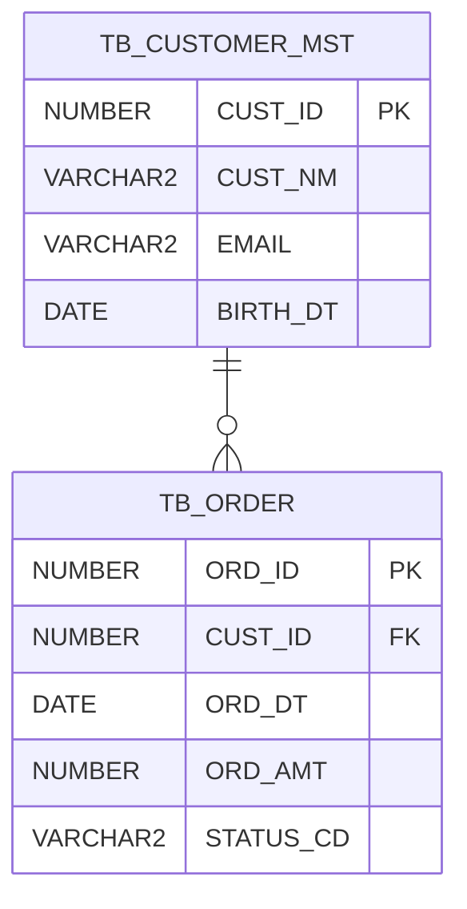

# Oracle DB Designer

Oracle Database 설계를 요구사항 수집부터 DDL 생성까지 6단계로 안내한다.
**3-Level ERD 접근법**: 개념 ERD → 논리 ERD → 물리 ERD 순서로 단계별 구체화.

**참조 파일** (Phase 0 시작 시 모두 Read):
- `references/naming-conventions.md` — Oracle 오브젝트 네이밍 규칙
- `references/data-type-guide.md` — 데이터 타입 선택 가이드
- `references/standard-dictionary.md` — 표준 용어 사전 템플릿 + 공통 약어
- `references/design-patterns.md` — 정규화/반정규화/파티션/Data Vault/DDD 패턴
- `references/ddl-templates.md` — DDL 생성 템플릿 및 실행 순서

---

## 핵심 설계 원칙 (Quick Reference)

### Oracle 오브젝트 접두사 요약

| 오브젝트 | 접두사 | 예시 |
|----------|--------|------|
| 테이블 | `TB_` | `TB_ORDER`, `TB_CUSTOMER_MST` |
| 뷰 | `VW_` | `VW_ORDER_SUMMARY` |
| Materialized View | `MV_` | `MV_DAILY_SALES` |
| 인덱스 | `IX_` / `UIX_` / `BIX_` | `IX_TB_ORDER_ORD_DT` |
| 시퀀스 | `SQ_` | `SQ_ORDER` |
| 트리거 | `TRG_` | `TRG_ORDER_BIR` |
| 패키지 | `PKG_` | `PKG_ORDER_MGMT` |
| 프로시저 | `PRC_` | `PRC_CREATE_ORDER` |
| 함수 | `FN_` | `FN_GET_ORDER_AMT` |
| PK 제약 | `PK_` | `PK_ORDER` |
| FK 제약 | `FK_{자식}_{부모}` | `FK_ORDER_DTL_ORDER` |
| UK 제약 | `UK_` | `UK_CUSTOMER_EMAIL` |
| CK 제약 | `CK_` | `CK_ORDER_STATUS_CD` |

### 공통 감사 컬럼 (모든 테이블 필수)

```sql
REGR_ID  VARCHAR2(50 CHAR) NOT NULL,  -- 등록자 ID
REG_DT   DATE              NOT NULL,  -- 등록일시
MODR_ID  VARCHAR2(50 CHAR) NOT NULL,  -- 수정자 ID
MOD_DT   DATE              NOT NULL   -- 수정일시
```

### 테이블 접미사

| 접미사 | 의미 | 접미사 | 의미 |
|--------|------|--------|------|
| `_MST` | 마스터 | `_LOG` | 로그 |
| `_DTL` | 상세 | `_MAP` | 매핑(M:N) |
| `_HST` | 이력 | `_CD` | 공통코드 |
| `_TMP` | 임시 | `_STAT` | 통계 |

### 설계 방법론 선택

| 시스템 유형 | 권장 방법론 |
|------------|-----------|
| OLTP (업무 시스템) | 3NF 정규화 → 선택적 반정규화 |
| DW/Analytics | Star/Snowflake 디멘셔널 모델링 |
| 다소스 통합 DW | Data Vault 2.0 (Hub/Link/Satellite) |
| DDD 기반 시스템 | Aggregate → 테이블 클러스터, Bounded Context → 스키마 |

---

## 사용자 확인 방식

**원칙**: 확인할 항목이 3개 이하면 대화로 직접 질문. **4개 이상이면 설문서 파일을 생성**하여 사용자가 답변을 채우고 알려주면 읽어서 반영한다.

설문서 파일명 규칙:
- 요구사항 수집: `{프로젝트명}-questionnaire.md`
- Phase별 리뷰: `{프로젝트명}-review-phase{N}.md`

설문서 구조 원칙:
- 빈칸 형식으로 작성 (`(예: ...)` 힌트 포함)
- 체크박스(`[ ]`)로 선택 항목 구성
- 표 형식으로 반복 항목 제공
- 마지막에 "작성 완료 후 알려주세요" 안내 문구 포함

---

## Phase 0: 요구사항 수집

**목표**: 설계 방향을 결정하는 기본 정보 수집.

1. 참조 파일 5개를 모두 Read한다.
2. 사용자가 이미 요구사항/DDD 분석/기존 ERD를 제공했다면 Phase 0을 축약하거나 건너뛴다.
3. 아직 정보가 없다면 **`{프로젝트명}-questionnaire.md`** 파일을 아래 형식으로 생성한다:

```markdown
# Oracle DB 설계 요구사항 설문서 — {프로젝트명}

아래 항목을 작성해주세요. 완성 후 알려주시면 설계를 시작합니다.

## 1. 기본 정보
- **프로젝트/시스템명**: (예: OMS - 주문관리시스템)
- **비즈니스 도메인**: (예: 이커머스 주문/결제/배송 관리)
- **시스템 유형**: [ ] OLTP  [ ] DW/Analytics  [ ] Hybrid

## 2. Oracle 환경
- **Oracle 버전**: (예: 19c, 21c, 23ai)
- **캐릭터셋**: (예: AL32UTF8 권장)
- **연동 여부**: [ ] 신규  [ ] 기존 스키마 연동 → 스키마명:
- **표준 용어 사전 여부**: [ ] 없음  [ ] 있음 → 파일 경로:

## 3. 주요 엔티티 및 데이터 규모
| 주요 엔티티(한글) | 예상 초기 건수 | 연간 증가량 | 비고 |
|-----------------|--------------|------------|------|
| (예: 주문)       | 100만        | 500만/년   |      |
|                 |              |            |      |

## 4. 주요 쿼리 패턴
- **가장 빈번한 조회 조건**: (예: 주문일자 + 고객번호)
- **대량 배치 처리**: [ ] 없음  [ ] 있음 → 설명:
- **실시간 리포팅**: [ ] 없음  [ ] 있음 → 대상:

## 5. 특수 요구사항
- **이력 관리 필요 엔티티**: (예: 가격 변동, 상태 변경)
- **파티셔닝 고려 테이블**: (예: 주문 — 월별 Range)
- **보안/암호화 필요 컬럼**: (예: 카드번호, 주민번호)
- **기타 제약사항**:
```

4. 사용자가 파일을 작성하고 알려주면 Read → 요구사항 요약표 출력 후 Phase 1로 진행.

---

## Phase 1: 개념 설계

**목표**: 엔티티와 관계를 파악하여 개념 ERD 생성.

1. 수집된 요구사항에서 **핵심 엔티티**를 추출한다.
2. 각 엔티티를 접미사 기준으로 분류한다:
   - `_MST`: 변경 드문 기준 데이터 (상품, 고객, 직원)
   - 트랜잭션: 업무 이벤트 (주문, 결제, 배송)
   - `_HST`: 이력이 필요한 경우
   - `_CD`: 공통코드/분류코드
   - `_MAP`: M:N 연결
3. 엔티티 간 관계(1:1, 1:N, M:N)와 카디널리티를 정의한다.
4. Mermaid 개념 ERD를 생성한다 (속성 없이 엔티티+관계만):


5. **`{프로젝트명}-review-phase1.md`** 파일을 생성하여 확인 요청:

```markdown
# Phase 1 개념 설계 검토

아래 엔티티 목록과 ERD를 검토해주세요.

## 식별된 엔티티 목록
| 엔티티(한글) | 테이블명(예정) | 분류 | 설명 |
|------------|-------------|------|------|
| 고객       | TB_CUSTOMER_MST | _MST | 가입 고객 정보 |
| 주문       | TB_ORDER    | 트랜잭션 | 주문 헤더 |

## 엔티티 관계 요약
(위 Mermaid ERD 복사)

## 검토 항목
- [ ] 누락된 엔티티가 있나요? → 있다면 추가:
- [ ] 잘못된 관계가 있나요? → 있다면 수정:
- [ ] 분류(MST/DTL/HST 등)가 맞나요? → 수정 필요:
- [ ] 추가 의견:
```

---

## Phase 2: 논리 설계

**목표**: 표준 용어 사전 구축, 속성 정의, 정규화, 논리 ERD 생성.

1. **표준 용어 사전 구축**: `references/standard-dictionary.md`의 공통 약어를 기반으로 프로젝트 전용 사전을 구성한다. 기존 사전이 있으면 이를 기준으로 한다.

2. **속성 정의**: 각 엔티티의 컬럼을 표준 용어 사전 기준으로 명명한다:
   - `references/naming-conventions.md`의 컬럼 네이밍 규칙 적용
   - `references/data-type-guide.md`의 데이터 타입 선택 기준 적용
   - 모든 테이블에 감사 컬럼(REGR_ID, REG_DT, MODR_ID, MOD_DT) 추가

3. **정규화 수행**:
   - OLTP: 1NF → 2NF → 3NF 순서로 검토
   - 의도적 반정규화는 이유를 주석으로 명시
   - `references/design-patterns.md`의 패턴 참조

4. **식별자 설계**: 대리키(Surrogate Key) vs 자연키 선택, FK 관계 정의

5. 논리 ERD를 Mermaid로 생성한다 (속성 포함):



6. **`{프로젝트명}-review-phase2.md`** 파일 생성하여 확인 요청 (컬럼 목록 표, 정규화 결정 사항, 수정 항목 체크리스트 포함).

---

## Phase 3: 물리 설계

**목표**: Oracle 특화 물리 구조 결정 (테이블스페이스, 파티션 키, 인덱스, 시퀀스).

### 3-1. 테이블스페이스 배치

```
TS_{시스템}_DATA   — 일반 테이블
TS_{시스템}_INDEX  — 인덱스 (데이터와 I/O 분리)
TS_{시스템}_LOB    — CLOB/BLOB 컬럼
TS_{시스템}_ARCH   — 이력/로그 테이블 (선택)
```

### 3-2. 파티션 키 설계

`references/design-patterns.md`의 "파티션 키 설계" 섹션을 참조하여 아래 7단계를 수행한다:

1. **후보 선별**: 예상 건수 1,000만 이상 또는 데이터 보관 정책이 있는 테이블
2. **쿼리 패턴 분석**: WHERE절 빈출 컬럼 추출 (Phase 0 쿼리 패턴 참조)
3. **파티션 유형 결정**:
   - 날짜형 연속값 → Range + Interval 자동 확장
   - 이산 범주값(10~50개) + 균등 분포 → List
   - 고카디널리티, 균등 분산 → Hash
   - 날짜+범주 복합 요구 → Composite (Range-List 또는 Range-Hash)
4. **파티션 크기 산정**: 파티션당 1~10GB 권장
5. **자식 테이블 처리**: 부모와 항상 함께 조회 → Reference Partitioning
6. **인덱스 전략 결정**: 파티션 키가 PK 포함 여부 → LOCAL vs GLOBAL
7. **유지보수 계획**: 보관 기간, DROP PARTITION 주기, Exchange Loading 여부

### 3-3. 인덱스 전략

| 대상 | 인덱스 유형 | 기준 |
|------|-----------|------|
| PK | 자동 생성 (B-tree) | 항상 |
| FK 컬럼 | B-tree | FK가 있는 모든 컬럼 (Oracle FK 잠금 방지) |
| 빈출 WHERE 조건 | B-tree 단일/복합 | 쿼리 패턴 분석 결과 |
| 저카디널리티 + DW | Bitmap | STATUS_CD, REGION_CD 등 |
| 함수 변환 조건 | Function-based | `UPPER(NM)`, `TRUNC(DT)` |
| 신규 인덱스 테스트 | Invisible | 프로덕션 영향 없이 테스트 |

복합 인덱스 컬럼 순서: `(가장 자주 사용되는 = 조건) → (범위 조건) → (나머지)`

### 3-4. 시퀀스 설계

- Oracle 11g 이하 또는 다중 테이블 공유: `CREATE SEQUENCE SQ_{테이블명} CACHE 1000`
- Oracle 12c+, 단일 테이블: `GENERATED ALWAYS AS IDENTITY` 검토

### 3-5. 물리 설계 확인

**`{프로젝트명}-review-phase3.md`** 파일을 생성하여 확인 요청:
- 테이블별 테이블스페이스 배치 표
- 파티션 적용 테이블 목록 (키, 유형, 파티션 크기)
- 인덱스 목록 (테이블, 컬럼, 유형, LOCAL/GLOBAL)
- 시퀀스 목록

---

## Phase 4: DDL 생성

**목표**: `references/ddl-templates.md` 기반으로 실행 가능한 DDL 스크립트 생성.

1. **DDL 실행 순서** (`references/ddl-templates.md` 참조):
   시퀀스 → 테이블(부모→자식) → PK/UK/CK 제약 → FK 제약 → 인덱스 → 뷰 → 동의어 → GRANT

2. **필수 포함 항목**:
   - 모든 테이블: `TABLESPACE`, `COMMENT ON TABLE`, `COMMENT ON COLUMN` (모든 컬럼)
   - 제약조건: 반드시 명시적 이름 부여 (SYS_C자동생성 금지)
   - 파티션 테이블: 파티션 정의 + LOCAL 인덱스

3. **DDL 파일 저장**: `{프로젝트명}-ddl.sql`
4. **롤백 스크립트 저장**: `{프로젝트명}-rollback.sql` (역순 DROP)

5. DDL 생성 완료 후 사용자에게 파일 경로 안내 및 검토 요청.

---

## Phase 5: 검토 및 최적화

**목표**: 안티패턴 검사, 컨벤션 준수 확인, 최종 리포트 생성.

### 안티패턴 진단표

| # | 안티패턴 | 검사 방법 | 심각도 |
|---|----------|----------|--------|
| 1 | **God Table** (컬럼 30개 초과) | 컬럼 수 집계 | 경고 |
| 2 | **감사 컬럼 누락** (REGR_ID/REG_DT/MODR_ID/MOD_DT) | 테이블별 확인 | 오류 |
| 3 | **VARCHAR2 BYTE 의미론** (`n` 단독 사용) | DDL 텍스트 검색 | 오류 |
| 4 | **CHAR 남용** (가변 길이 데이터에 CHAR) | 데이터 특성 검토 | 경고 |
| 5 | **FK 인덱스 누락** (FK 컬럼에 인덱스 없음) | FK vs 인덱스 비교 | 오류 |
| 6 | **미명명 제약조건** (SYS_C자동생성) | 제약조건 이름 검사 | 오류 |
| 7 | **대용량 미파티셔닝** (1000만+ 테이블) | 볼륨 추정 vs 파티션 확인 | 경고 |
| 8 | **과도한 CLOB** (VARCHAR2(4000)으로 충분한 경우) | 컬럼 분석 | 정보 |
| 9 | **COMMENT 누락** (테이블/컬럼 설명 없음) | DDL 검색 | 경고 |
| 10 | **EAV 패턴** (속성명-값 쌍 저장 구조) | 구조 패턴 분석 | 경고 |

### 검사 수행

1. 위 안티패턴 10가지를 항목별로 검사
2. 네이밍 컨벤션 준수 확인 (`references/naming-conventions.md`)
3. 표준 용어 사전 약어 사용 확인 (`references/standard-dictionary.md`)
4. 성능 리뷰: 인덱스 커버리지, Hot Partition 위험, 반정규화 적절성

### 최종 리뷰 리포트 생성

`{프로젝트명}-review-report.md` 파일 생성:
```markdown
# DB 설계 검토 리포트 — {프로젝트명}
검토일: {날짜}

## 요약
- 전체 테이블 수: N개 | 오류: X건 | 경고: Y건 | 정보: Z건

## 안티패턴 검사 결과
| 항목 | 결과 | 대상 | 권고 조치 |
|------|------|------|----------|

## 네이밍 컨벤션 준수율
...

## 성능 리뷰
...

## 권고 조치 목록 (우선순위 순)
1. [오류] ...
2. [경고] ...
```

5. 수정이 필요한 항목이 있으면 DDL 재생성 후 Phase 4 결과물 갱신.

---

## 출력 원칙

- **설문서 우선**: 질문이 많으면 무조건 파일 생성 → 사용자 답변 대기
- **단계별 진행**: 각 Phase 확인 없이 다음 Phase 진행 금지
- **왜(Why) 설명**: 설계 결정마다 이유 명시 (예: "FK 인덱스를 추가한 이유: Oracle은 FK 잠금 해소를 위해 반드시 필요")
- **Mermaid 다이어그램**: 개념/논리 ERD는 반드시 Mermaid로 시각화
- **파일 저장**: DDL, 설문서, 리뷰 파일은 항상 Write로 저장 후 경로 안내
- **표준 사전 우선**: 기존 용어 사전이 있으면 내장 기준보다 우선 적용

---

## 결정 트리 (진입점 선택)

```
사용자 요청 유형 판단:
│
├── "처음부터 설계해줘" / 요구사항만 있음
│   └── Phase 0 → 설문서 생성
│
├── ERD/요구사항 문서를 첨부함
│   └── Phase 1 (개념 설계) 또는 Phase 2 (논리 설계)부터 시작
│
├── "DDL 생성해줘" / 논리 설계가 완료됨
│   └── Phase 3 (물리 설계) → Phase 4 (DDL 생성)
│
├── "기존 DDL을 리뷰해줘" / DDL 파일 첨부
│   └── Phase 5 (검토 및 최적화)부터 시작
│
├── "파티션 설계해줘" / "인덱스 설계해줘"
│   └── Phase 3의 해당 섹션만 집중 수행
│
└── "네이밍 컨벤션 검토해줘" / "컨벤션 맞게 수정해줘"
    └── references/naming-conventions.md + Phase 5 검사
```
