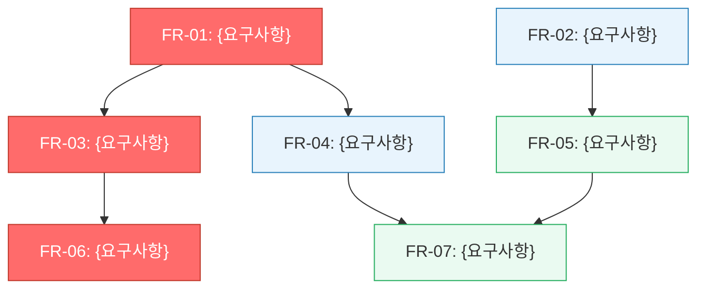

# 로드맵: {PRD 제목}

| 항목 | 내용 |
|------|------|
| 원본 PRD | {PRD 파일 경로} |
| 생성일 | {YYYY-MM-DD} |
| 버전 | 1.0.0 |
| 상태 | Draft |
| 작성자 | {작성자} |

---

## 1. 비전 & 목표

{PRD 섹션 1(문제 정의)과 섹션 2(목표)에서 추출한 핵심 비전과 제품 목표를 1-3문장으로 요약}

---

## 2. 성공 지표

| 지표 | 현재 값 | 목표 값 | 측정 방법 | 달성 예상 시점 |
|------|---------|---------|-----------|---------------|
| {KPI 1} | {현재} | {목표} | {방법} | {Phase NOW/NEXT/LATER} |
| {KPI 2} | {현재} | {목표} | {방법} | {Phase} |

---

## 3. 의존성 분석

### 3.1 의존성 매트릭스

| FR ID | 요구사항 | 우선순위 | 선행 FR (이것이 완료되어야 시작 가능) | 후행 FR (이것이 완료되면 시작 가능) |
|-------|----------|---------|--------------------------------------|--------------------------------------|
| FR-01 | {요구사항 설명} | P0 | — | FR-03, FR-04 |
| FR-02 | {요구사항 설명} | P0 | — | FR-05 |
| FR-03 | {요구사항 설명} | P0 | FR-01 | FR-06 |
| FR-04 | {요구사항 설명} | P1 | FR-01 | FR-07 |
| FR-05 | {요구사항 설명} | P1 | FR-02 | FR-07 |

### 3.2 의존성 플로우차트



> 🔴 빨간색: 크리티컬 패스 | 🔵 파란색: P0 | 🟢 초록색: P1 | 🟡 노란색: P2

---

## 4. 크리티컬 패스

**최장 의존 체인**: `FR-01 → FR-03 → FR-06 → {종료}`

**예상 최소 기간**: {N}주 (이 체인의 모든 작업이 순차 완료되어야 하는 최소 시간)

> 크리티컬 패스의 어느 한 FR이 지연되면 전체 프로젝트 일정이 동일하게 지연됩니다.
> 이 경로의 FR에는 리소스를 우선 배분하고, 블로커 발생 시 즉시 에스컬레이션하세요.

---

## 5. Phase별 로드맵

### Phase NOW — 현재 스프린트 (P0 필수 구현)

**기간**: {시작일} ~ {종료일} ({N}주)
**목표**: {P0 FR 완료를 통해 달성하려는 핵심 가치}
**담당 팀**: {팀/담당자}

| FR ID | 요구사항 | 선행 FR | 예상 기간 | 리스크 수준 |
|-------|----------|---------|-----------|-------------|
| FR-01 | {설명} | — | {N}일 | 낮음 |
| FR-02 | {설명} | — | {N}일 | 중간 |
| FR-03 | {설명} | FR-01 | {N}일 | 낮음 |

**Phase NOW 마일스톤**: {날짜} — {마일스톤명}
**완료 기준**: {PR에서 도출된 P0 인수 조건 요약}

---

### Phase NEXT — 다음 1-2 스프린트 (P1 핵심 기능)

**기간**: {시작일} ~ {종료일} ({N}주)
**목표**: {P1 FR 완료를 통해 달성하려는 핵심 가치}

| FR ID | 요구사항 | 선행 FR | 예상 기간 | 리스크 수준 |
|-------|----------|---------|-----------|-------------|
| FR-04 | {설명} | FR-01 | {N}일 | 중간 |
| FR-05 | {설명} | FR-02 | {N}일 | 높음 |

**Phase NEXT 마일스톤**: {날짜} — {마일스톤명}

---

### Phase LATER — 백로그 (P2 개선 기능)

**기간**: {시작일 이후}
**목표**: {P2 FR 완료를 통해 달성하려는 개선 가치}

| FR ID | 요구사항 | 선행 FR | 예상 기간 | 리스크 수준 |
|-------|----------|---------|-----------|-------------|
| FR-07 | {설명} | FR-04, FR-05 | {N}일 | 낮음 |

---

## 6. Gantt 차트 (전체 일정)

```mermaid
gantt
    title 로드맵: {PRD 제목}
    dateFormat YYYY-MM-DD
    axisFormat %m/%d

    section Phase NOW (P0)
    FR-01 {요구사항명}     :crit, fr01, {시작일}, {N}d
    FR-02 {요구사항명}     :fr02, {시작일}, {N}d
    FR-03 {요구사항명}     :crit, fr03, after fr01, {N}d

    section 마일스톤 1
    MVP 릴리스             :milestone, m1, after fr03, 0d

    section Phase NEXT (P1)
    FR-04 {요구사항명}     :fr04, after fr01, {N}d
    FR-05 {요구사항명}     :fr05, after fr02, {N}d

    section 마일스톤 2
    베타 릴리스            :milestone, m2, after fr05, 0d

    section Phase LATER (P2)
    FR-07 {요구사항명}     :fr07, after fr05, {N}d

    section 최종 마일스톤
    정식 출시              :milestone, m3, after fr07, 0d
```

---

## 7. 리스크 조정 타임라인

| Phase | 기본 기간 | 리스크 요인 (PRD 섹션 12) | 버퍼 | 조정 기간 |
|-------|-----------|--------------------------|------|-----------|
| NOW | {N}주 | {리스크 설명} | +{N}일 | {N}주 |
| NEXT | {N}주 | {리스크 설명} | +{N}일 | {N}주 |
| LATER | {N}주 | — | — | {N}주 |

**총 예상 기간**: {N}주 (리스크 버퍼 포함)
**신뢰 구간**: {낙관 N주} ~ {비관 N주}

---

## 8. 외부 의존성 트래킹

| 의존성 | 유형 | 담당 팀/업체 | 현재 상태 | 영향 받는 Phase | 지연 시 대응 |
|--------|------|-------------|-----------|-----------------|-------------|
| {PRD 섹션10에서 추출} | 기술/외부API/법무 | {팀} | {대기중/진행중/완료} | NOW | {대응 방안} |

---

## 9. 다음 단계

- [ ] `docs/TASKS-{title}.md`에서 세부 태스크 확인 및 담당자 배정
- [ ] 팀 리뷰 미팅에서 로드맵 공유 및 Phase NOW 범위 확정
- [ ] Phase NOW 스프린트 킥오프 미팅 일정 잡기
- [ ] 크리티컬 패스 FR에 리소스 우선 배분
- [ ] 외부 의존성 상태 주간 체크 프로세스 수립
- [ ] Jira/Linear에 Phase NOW 태스크 임포트
